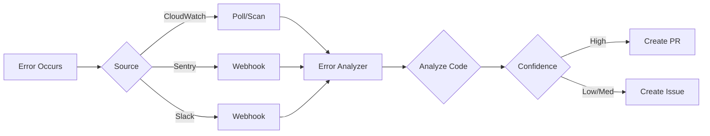

# Automated Error Monitoring & Resolution System

An intelligent system that automatically monitors errors from multiple sources (AWS CloudWatch, Sentry, Slack), analyzes them, and creates GitHub issues or pull requests for resolution.

## Features

- 🔍 **Multi-Source Monitoring**: Integrates with AWS CloudWatch, Sentry, and Slack
- 🤖 **Automated Analysis**: Analyzes error logs and identifies problematic code in your GitHub repository
- 📝 **Intelligent Issue Creation**: Automatically creates detailed GitHub issues with error context
- 🔧 **PR Generation**: Can create pull requests for high-confidence fixes (when configured)
- 🌐 **Webhook Support**: Receives real-time error notifications via webhooks
- ⚡ **Fast & Efficient**: Built with Bun for optimal performance

## Architecture

The system consists of several key components:

1. **CloudWatch Service**: Fetches and monitors error logs from AWS CloudWatch
2. **Sentry Service**: Processes Sentry error events and webhooks
3. **GitHub Service**: Searches code, creates issues, and manages pull requests
4. **Error Analyzer**: Analyzes errors and determines the best course of action
5. **Webhook Server**: Receives real-time notifications from Slack and Sentry

## Installation

### Prerequisites

- [Bun](https://bun.sh) v1.2.18 or later
- GitHub Personal Access Token with repo permissions
- (Optional) AWS credentials with CloudWatch Logs read access
- (Optional) Sentry authentication token
- (Optional) Slack webhook URL or bot token

### Setup

1. Clone the repository:
```bash
git clone https://github.com/nalindard/she-collects.git
cd she-collects
```

2. Install dependencies:
```bash
bun install
```

3. Configure environment variables:
```bash
cp .env.example .env
# Edit .env with your credentials
```

## Configuration

### Required Environment Variables

```env
GITHUB_TOKEN=your_github_personal_access_token
GITHUB_OWNER=your_github_username_or_org
GITHUB_REPO=your_repository_name
```

### Optional Environment Variables

#### AWS CloudWatch
```env
AWS_REGION=us-east-1
AWS_ACCESS_KEY_ID=your_aws_access_key
AWS_SECRET_ACCESS_KEY=your_aws_secret_key
AWS_LOG_GROUP_NAME=your_cloudwatch_log_group
```

#### Sentry
```env
SENTRY_DSN=your_sentry_dsn
SENTRY_AUTH_TOKEN=your_sentry_auth_token
SENTRY_ORGANIZATION=your_sentry_org
SENTRY_PROJECT=your_sentry_project
```

#### Slack
```env
SLACK_WEBHOOK_URL=your_slack_webhook_url
SLACK_BOT_TOKEN=your_slack_bot_token
```

#### Server
```env
PORT=3000
WEBHOOK_SECRET=your_webhook_secret
```

## Usage

### Run as a One-Time Scan

Scan CloudWatch logs for errors in the last 60 minutes:

```bash
bun start
```

### Run as a Webhook Server

Start the server to receive real-time webhooks:

```bash
bun run server
```

The server will listen on the configured port (default: 3000) and provide the following endpoints:

- `POST /webhook/slack` - Receive Slack error notifications
- `POST /webhook/sentry` - Receive Sentry error events
- `POST /trigger-scan` - Manually trigger a CloudWatch scan
- `GET /health` - Health check endpoint

### Development Mode

Run in watch mode for development:

```bash
bun run dev
```

## Integration Guide

### Slack Integration

1. Create a Slack App or Webhook
2. Configure your ECS applications to send error alerts to your Slack webhook
3. Set up a Slack webhook that forwards to your monitoring system:
   ```
   POST http://your-server:3000/webhook/slack
   ```

### Sentry Integration

1. Go to your Sentry project settings
2. Navigate to "Integrations" → "WebHooks"
3. Add a new webhook pointing to:
   ```
   POST http://your-server:3000/webhook/sentry
   ```
4. Select the event types you want to monitor (e.g., `issue.created`, `event.alert`)

### AWS CloudWatch Integration

The system can poll CloudWatch logs periodically or be triggered manually:

```bash
curl -X POST http://your-server:3000/trigger-scan
```

### GitHub Setup

1. Create a GitHub Personal Access Token with the following permissions:
   - `repo` (Full control of private repositories)
   - `workflow` (Update GitHub Actions workflows)

2. Set the token in your environment variables

## Deployment

### Docker Deployment

Create a `Dockerfile`:

```dockerfile
FROM oven/bun:latest

WORKDIR /app

COPY package.json bun.lock ./
RUN bun install

COPY . .

CMD ["bun", "run", "server"]
```

Build and run:

```bash
docker build -t error-monitoring .
docker run -p 3000:3000 --env-file .env error-monitoring
```

### AWS ECS/Fargate

1. Push your Docker image to ECR
2. Create an ECS task definition
3. Configure environment variables
4. Deploy as an ECS service

### Amplify Deployment

For serverless deployment on AWS Amplify, configure the build settings to run the webhook server.

## How It Works

1. **Error Detection**: The system receives error notifications from various sources:
   - CloudWatch logs (via polling or scheduled jobs)
   - Sentry webhooks (real-time)
   - Slack alerts (via webhook forwarding)

2. **Error Analysis**: 
   - Extracts error messages and stack traces
   - Searches GitHub repository for related code
   - Identifies the affected files and line numbers
   - Determines the confidence level of the analysis

3. **Automated Action**:
   - High confidence (>80%): Can create a pull request with suggested fixes
   - Medium/Low confidence: Creates a detailed GitHub issue
   - Checks for duplicate issues before creating new ones

4. **Issue/PR Content**:
   - Error source and severity
   - Complete error message and stack trace
   - Affected file and line number
   - Suggested fixes and actions
   - Related CloudWatch logs (if available)
   - Metadata and context

## Example Workflow



## Customization

### Adding New Error Sources

Extend the `WebhookHandler` class to support additional error sources:

```typescript
// src/handlers/webhook.ts
handleCustomWebhook(payload: CustomPayload): ErrorEvent | null {
  // Your parsing logic here
}
```

### Custom Error Analysis

Modify the `ErrorAnalyzer` class to implement custom analysis logic:

```typescript
// src/services/analyzer.ts
async analyzeError(error: ErrorEvent): Promise<ErrorAnalysis | null> {
  // Your custom analysis logic
}
```

## Troubleshooting

### Common Issues

1. **GitHub API Rate Limiting**
   - Solution: Use a GitHub App token instead of a personal access token
   - Check rate limits: `curl -H "Authorization: token YOUR_TOKEN" https://api.github.com/rate_limit`

2. **AWS Credentials Not Working**
   - Verify IAM permissions include `logs:FilterLogEvents`
   - Check AWS region configuration

3. **Webhooks Not Receiving Data**
   - Ensure your server is publicly accessible
   - Check webhook signature validation
   - Verify firewall/security group settings

## License

This project is created for automated error monitoring and resolution.

## Contributing

Contributions are welcome! Please feel free to submit issues or pull requests.

---

Built with ❤️ using [Bun](https://bun.sh)
